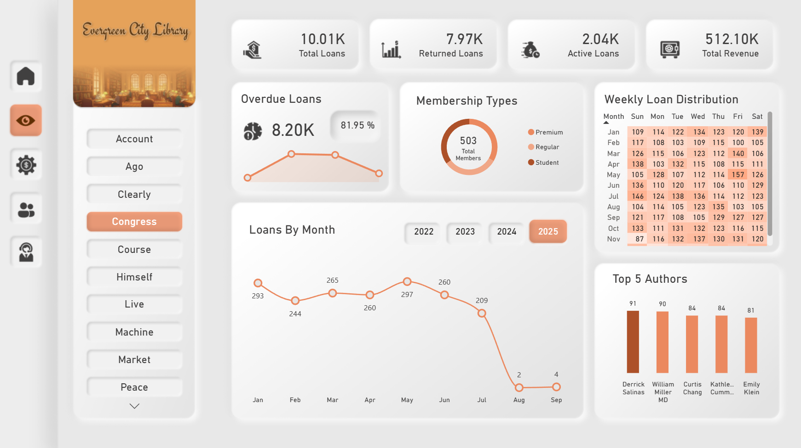
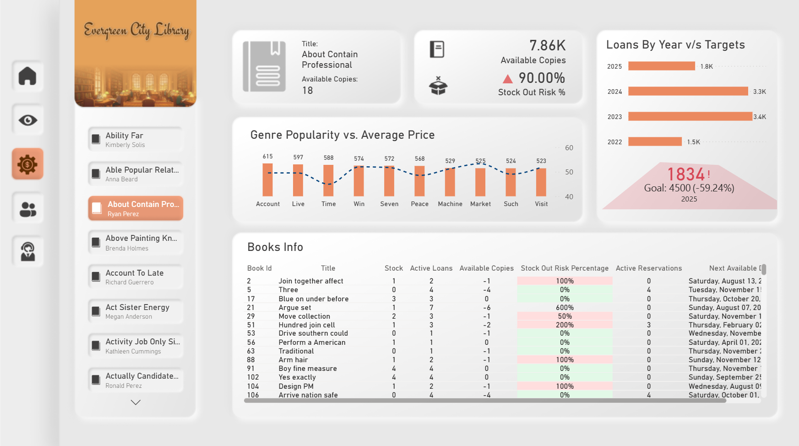
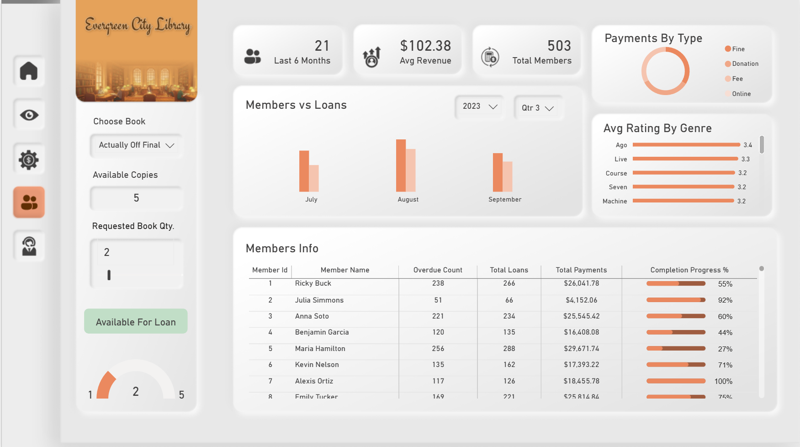

# 📚 Library Management Analytics Dashboard (End-to-End Power BI Project)

> A complete **data analytics project** built using **PostgreSQL and Power BI**, designed to analyze library operations — book loans, inventory, members, payments, reviews, and staff insights.

---

## 🧩 Project Overview

This project simulates how a real library system can utilise data to monitor daily operations and enhance decision-making—showcasing a realistic, business-ready dashboard that a library manager can use daily.


📊 **Goal:**  
I built the project end-to-end — from **SQL data modelling and views** to **interactive Power BI dashboards** — to answer key business questions like:
- Which books and authors are most in demand?
- How many books are overdue and why?
- Is inventory sufficient to meet demand?
- How active and valuable are library members?
- How do reviews and ratings reflect book quality?

---

## ⚙️ Tech Stack

| Tool | Purpose |
|------|--------|
| 🐙 **Excel** | Data Audit & Data Preparation |
| 🗃️ **PostgreSQL** | Data storage, joins, aggregations, SQL Views |
| 📊 **Power BI** | Data modeling, DAX, dashboard visualization |
| 🧮 **DAX** | KPIs, measures, parameters, logic |
| 🐙 **Figma** | Dashboard UI/UX |
| ☁️ **Power BI Service** | Publishing & scheduled refresh |
| 🐙 **GitHub** | Project documentation & portfolio |


---

## 🧮 Dataset Overview

The dataset represents a complete library ecosystem and includes the following tables:

| Table | Description |
|------|-------------|
| **books** | Book details, price, and stock |
| **authors** | Author names and nationality |
| **genres** | Book genres |
| **book_loans** | Loan, due date, return date, and fines |
| **payments** | Member payments and payment types |
| **reservations** | Book reservation status |
| **members** | Member details and membership type |
| **reviews** | Book ratings and comments |
| **staff** | Staff position and salary |

📊 **Total Rows:** ~21,000+ across all tables  
📅 **Time Range:** 2022-2025

---

## 🧹 Data Processing Workflow

### Key Steps:
1. Exported data into **PostgreSQL**
2. Created **SQL VIEWS** to:
   - Join related tables
   - Perform aggregations
   - Optimize Power BI performance
3. Built a **Calendar table** for time intelligence
4. Imported SQL Views into Power BI
5. Created DAX measures for KPIs and logic
6. Designed interactive dashboards

---

## 📈 Dashboard Overview

### 🧭 **Page 1: Navigation**
- Custom library-themed landing page
- Button-based navigation between report pages
- Improves usability and report flow

  

---

### 📊 **Page 2: Overview**
**Purpose:** Quick understanding of overall library performance

- KPIs: Total Loans, Active Loans, Returned Loans
- KPIs: Overdue Loans & Overdue %
- KPI: Total Revenue (Payments)
- Line Chart: Loans by Month (Year slicer)
- Donut Chart: Membership Type distribution
- Bar Chart: Top 5 Authors
- Matrix: Weekly Loan Distribution (busy weeks/months)
- Genre slicer applied only to Top Authors

  

---

### 📦 **Page 3: Inventory**
**Purpose:** Inventory control and stock risk monitoring

- KPIs: Available Copies, Stock-Out Risk %
- Table: Book stock, active loans, reservations, next available date
- Conditional formatting highlights stock risk
- Bar Chart: Loans by Published Year with target KPI
- Bar + Line Chart: Genre vs Loan Count & Avg Price
- KPI Card: Selected book availability

  

---

### 👥 **Page 4: Members**
**Purpose:** Member activity and revenue insights

- KPIs: New Members (6 months), Avg Revenue per Member, Total Members
- Clustered Column Chart: Membership growth
- Stacked Column Chart: Payments by type
- Donut Chart: Payments by category
- Table: Member activity with progress bar
- What-If parameter to check requested book availability
- Gauge & KPI showing availability result

  

---

### ⭐ **Page 5: Insights & Reviews**
**Purpose:** Quality, reviews, and staff analysis

- KPIs: Total Staff, Avg Salary, Total Reviews, Avg Rating
- Line + Stacked Column Chart: Rating vs Loans by Genre
- Area Chart: Staff by Position
- Star rating slicer (1–5)
- Interactive review navigation using bookmarks
- KPI cards showing recent reviews with star icons
- Donut Charts: Highest and lowest review months

  

---

## 📊 Sample SQL Views
The following **SQL VIEWS** were created in PostgreSQL and imported into Power BI:

```sql
CREATE OR REPLACE VIEW kpi_cards AS
WITH kpi_cards AS(
	SELECT COUNT(*) AS total_loans,
				 COUNT(*) FILTER (WHERE return_date IS NOT NULL) AS returned_loans,
				 COUNT(*) FILTER (WHERE return_date IS NULL) AS active_loans,
				 COUNT(*) FILTER (
				   WHERE (return_date IS NOT NULL AND return_date > due_date)
				      OR (return_date IS NULL AND due_date < CURRENT_DATE)) AS overdue_loans
	FROM book_loans 
),
revenue AS (
	SELECT SUM(amount) AS total_revenue
	FROM payments
),
book_stocks AS(
	SELECT SUM(stock) AS total_stocks,
	       COUNT(*) AS total_books
	FROM books
),
staffs AS (
	SELECT COUNT(*) AS total_staff,
				ROUND(AVG(salary),2 ) AS avg_salary
	FROM staff
),
average_rating AS (
	SELECT ROUND(AVG(rating), 2) AS avg_rating,
	       COUNT(reviews) AS total_reviews
	FROM reviews
)
SELECT total_loans,
       returned_loans,
			 active_loans,
			 overdue_loans,
			 ROUND((overdue_loans::decimal / total_loans)*100, 2) AS overdue_in_percent,
			 total_revenue,
			 (total_stocks - active_loans) AS available_copies,
			 total_books,
			 total_staff,
			 avg_salary,
			 avg_rating,
			 total_reviews
FROM kpi_cards, revenue, book_stocks, staffs, average_rating;
```

---

## 🔹 Deployment & Refresh
- Report published to **Power BI Service**
- Scheduled refresh:
  - **9:00 AM**
  - **9:00 PM**

---

## 🔹 Key Skills Demonstrated
- SQL Views & joins
- Data modeling in Power BI
- Advanced DAX measures
- Conditional formatting
- Bookmarks & parameters
- Inventory and availability logic
- End-to-end BI workflow

---

## 🔹 Outcome
This dashboard helps library management:
- Reduce overdue books
- Manage inventory efficiently
- Understand member activity
- Improve decision-making using data

## 📊 Power BI DAX Highlights

> ```DAX
> TotalReviewsByMember = 
> VAR SelectedMember =
>    SELECTEDVALUE(last_30_days_reviews[member_name])
> RETURN
> CALCULATE(
>   COUNTROWS(last_30_days_reviews),
>   FILTER(
>      ALL(last_30_days_reviews),
>      last_30_days_reviews[member_name] = SelectedMember
> )
> ```

---
## 👨‍💻 About Me

Hi, I’m **Gaurav Khanna**, a Data Analyst passionate about turning complex data into simple, impactful insights.  
Skilled in **Power BI, SQL, Excel, and Python**, I love building dashboards that tell a story and uncover hidden trends.


## 🤝 Connect with Me

🌐 **Portfolio:** [https://gouravkhanna03.github.io/portfolio/]  
💼 **LinkedIn:** [[your LinkedIn profile](https://www.linkedin.com/in/gauravkhanna03/)]  
📧 **Email:** [gouravkhanna03@gmail.com]


## 🔖 Keywords

`Power BI` `SQL` `Data Analytics` `Library Dashboard` `Python` `Data Visualization` `ETL` `Data Cleaning` `Storytelling with Data` `Dashboard Design` `SQL` `PBI Dashboard`
